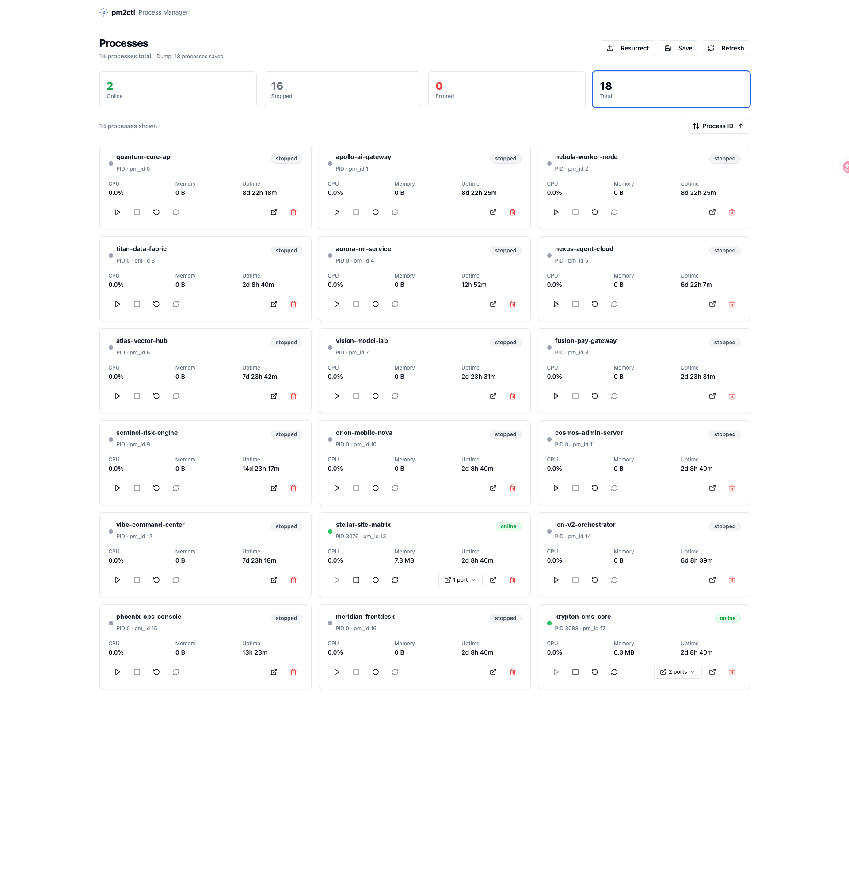

# pm2ctl

PM2 进程管理器的 Web 控制面板。通过浏览器可视化管理 PM2 进程，支持实时监控、进程操作、日志查看等功能。



## 功能

- **进程仪表盘** — 实时展示所有 PM2 进程，支持按状态筛选、多维度排序
- **进程操作** — 启动、停止、重启、重载、删除单个进程
- **进程详情** — CPU/内存/运行时间指标、进程元信息、命令行查看
- **实时日志** — 查看进程 stdout/stderr 的最新输出
- **实时更新** — 通过 Server-Sent Events 推送进程状态变化（2 秒间隔）
- **进程 Dump** — 保存和恢复 PM2 进程列表快照
- **端口检测** — 自动发现进程监听的端口

## 安装

```bash
npm install -g pm2-web-ctl
```

或者从源码运行：

```bash
git clone <repo-url>
cd pm2-web-ctl
npm run install:all
npm run build
```

## 使用

一行命令启动，无需安装：

```bash
npx pm2-web-ctl                    # 默认端口 3456
npx pm2-web-ctl --port 8080        # 自定义端口
npx pm2-web-ctl --host 127.0.0.1   # 绑定指定地址
npx pm2-web-ctl --no-open          # 启动后不自动打开浏览器
npx pm2-web-ctl --help             # 查看帮助
```

全局安装后也可直接使用：

```bash
npm install -g pm2-web-ctl
pm2ctl                    # 同上，参数一致
```

启动后访问 `http://localhost:3456` 即可打开控制面板。

### 脚本

```bash
./start.sh                # 后台启动（安装依赖 + 启动服务）
./start.sh --build        # 先构建前端再启动
./start.sh --no-install   # 跳过依赖安装
./stop.sh                 # 停止服务
```

## 开发

```bash
# 安装所有依赖
npm run install:all

# 同时启动后端和前端开发服务器（前端热更新）
npm run dev

# 单独启动后端
npm run dev:backend

# 单独启动前端开发服务器
npm run dev:frontend

# 构建前端
npm run build
```

- 后端：`backend/server.js` — Express + PM2 API
- 前端：`frontend/` — React + Vite + Tailwind CSS

## 技术栈

- **后端** — Node.js + Express + pm2
- **前端** — React 19 + React Router + Tailwind CSS + Radix UI + Lucide
- **构建** — Vite + TypeScript

---

由 [开点](https://www.kai-dian.com) 出品
